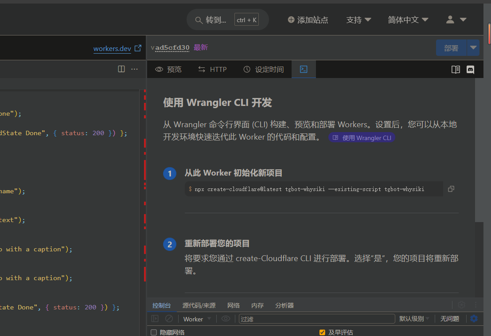

## 使用 Telegram Bot Webhook 与 Cloudflare Workers 以及 GitHub Actions 尝试搭建免费快速的无服务器 Telegram Bot

- **Telegram Bot Webhook**：使用 Telegram Bot Webhook 与 Cloudflare Workers 实现无服务器的 Telegram Bot。
- **无状态与状态管理**：Cloudflare Workers 几乎是无状态的，借助 Upstash Redis，可以实现无服务器的状态管理。
- **依赖注入命令**：利用 Redis 实现依赖注入的命令处理机制，便于管理和扩展。
- **本地开发与调试**：利用 Wrangler 在本地开发 Cloudflare Workers，并通过 Cloudflare Tunnel 实现内网穿透，方便测试和调试。
- **原生 API 支持**：Cloudflare Workers 对 Node.js 的支持有限，不能使用 Telegraf 等框架，只能利用原生 Telegram Bot API 实现功能。
- **任务处理**：对于 CPU 和内存密集型的任务，Cloudflare Workers 并不适合，可以利用 GitHub Actions 实现无服务器的定时任务或触发任务。
- **结论**：配置麻烦，继续加功能的话，可能会变得更复杂，倒是可以省钱不买服务器了


## Self Backup

### GitHub Actions 仓库配置

在仓库的 `Settings -> Secrets` 中添加以下 Secrets：

- `TELEGRAM_BOT_TOKEN` - Telegram Bot Token

### Cloudflare Workers 配置

在 Cloudflare Workers 中添加以下 Secrets 或环境变量：

- `botToken` - Telegram Bot Token
- `GITHUB_TOKEN` - GitHub Token
- `OWNER_ID` - Telegram Bot Owner ID
- `UPSTASH_REDIS_REST_TOKEN` - Upstash Redis Token
- `UPSTASH_REDIS_REST_URL` - Upstash Redis URL
- `WEBHOOK_SECRET_TOKEN` - Webhook Secret Token
- `REPO_OWNER` - GitHub Repo Owner
- `REPO_NAME` - GitHub Repo Name
- `GITHUB_DIR_PATH` - GitHub Dir Path
- `GITHUB_DIR_PATH_OUTPUT` - GitHub Dir Path Output

### Wrangler 使用

1. 下载并安装 Wrangler。
2. 登录 Cloudflare：
   ```bash
   wrangler login
   ```
3. 初始化 Cloudflare Workers 项目 
   ```bash
   wrangler init
   ```
    或者直接从 Cloudflare Workers Dashboard 创建项目后进入编辑代码页面复制wrangler命令在本地继续开发worker
    
4. 本地开发 Cloudflare Workers：
   ```bash
   wrangler dev --remote
   ```
   `--remote` 表示使用 Cloudflare Workers 的 Secrets，同时可以结合 Cloudflare Tunnel 实现内网穿透，测试 Bot 功能。Wrangler 默认本地端口为 `8787`。
5. 部署 Cloudflare Workers：
   ```bash
   wrangler deploy
   ```

6. 查看 Cloudflare Workers 日志：
   ```bash
   wrangler tail your-worker-name --format json
   ```
   `--format json` 表示以 JSON 格式输出日志。更详细。选择pretty输出更简洁

### 配置 Cloudflared tunnel 内网穿透

1. **买域名/注册域名**：在 Cloudflare 注册或购买域名。
2. **申请 Cloudflare 账号**：创建并登录 Cloudflare 账号。
3. **添加域名**：将域名添加到 Cloudflare 并选择免费套餐。
4. **修改域名解析**：根据 Cloudflare 提供的名称服务器修改域名的 DNS 设置。
5. **下载 Cloudflare 客户端**：安装命令行工具 `cloudflared`。

### 配置 Cloudflare Tunnel 以命令行方式

1. 登录 Cloudflare：
   ```bash
   cloudflared tunnel login
   ```
2. 创建隧道并生成隧道 ID：
   ```bash
   cloudflared tunnel create tg-localwoker-test
   ```
   记住生成的隧道 ID 及其凭证文件的路径。tg-localwoker-test 是隧道名称，可以自定义。

3. 配置域名 DNS 指向隧道：
   ```bash
   cloudflared tunnel route dns tg-localwoker-test tgbot.whysiki.fun
   ```
   可以配置任意子域名。tg-localwoker-test是隧道名称，tgbot.whysiki.fun是子域名。whysiki.fun是原始域名。

4. 编辑配置文件 `config.yml`：
   ```yaml
   tunnel: 4e348f59-c32b-408f-90b7-6bf4301be8e0
   credentials-file: C:\Users\Administrator\.cloudflared\4e348f59-c32b-408f-90b7-6bf4301be8e0.json

   ingress:
     - hostname: whysiki.fun.tgbot
       service: http://localhost:8787
     - service: http_status:404
   ```

5. 运行隧道并指定配置文件：
   ```bash
   cloudflared tunnel --config "C:\Program Files (x86)\cloudflared\.cloudflared\config.yml" run [4e348f59-c32b-408f-90b7-6bf4301be8e0]
   ```
6. 出网络问题时，可以尝试使用代理。